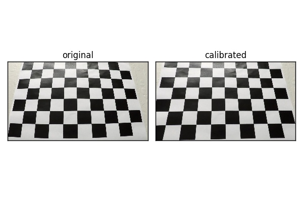
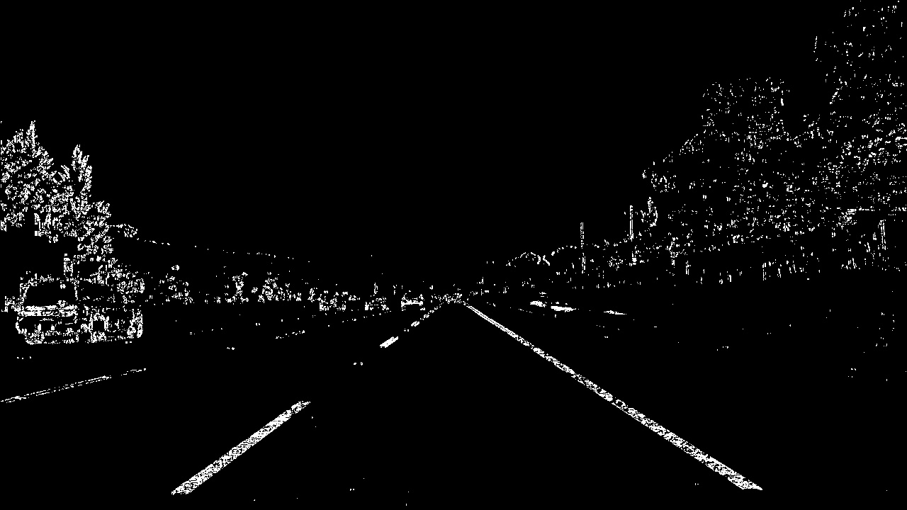

#Advanced Lane Finding Project

---

The goal of this project is to use methods from the field of computer vision to attempt to accurately identify the current traffic lane a vehicle is moving in.  The lane curvature and the position of the vehicle within the detected lane is also estimated.

In order to accomplish this, the following steps were taken:

* Remove distortion from the images/video by computing the camera calibration matrix and distortion coefficients from the given set of chessboard images.
* Create a thresholded binary image which removes unnecessary details from the image while preserving as much of the lane lines as possible.
* Apply a perspective transform to rectify binary image ("birds-eye view").
* Detect lane pixels and fit to find the lane boundary.
* Determine the curvature of the lane and vehicle position with respect to center.
* Warp the detected lane boundaries back onto the original image.
* Output visual display of the lane boundaries and numerical estimation of lane curvature and vehicle position.

## Rubric Points
**Below each project requirements is discussed and implementaions details are provided.**

---
###Writeup / README

#### Provide a Writeup / README that includes all the rubric points and how you addressed each one.  
This document serves as the Writeup / README necessary to fulfill this requirement.  It discusses each of the project requirements and provides details regarding the project implementation.

###Camera Calibration

#### Briefly state how you computed the camera matrix and distortion coefficients. Provide an example of a distortion corrected calibration image.

The code for this step is contained in the code cells of the IPython notebook located in _"./P4_Advanced_Lane_Finding.ipynb"_ under the section titled "Camera Calibration".

The first code block in this section, simply loads each of the twenty chessboard images used for calibration and displays them in a grid.  From these images, the inside corners were counted and it was determined that the chessboard used for calibration was a 9x6 board.

In the second code block, I created a method to find and show corners on the chessboard using OpenCV's `findChessboardCorners(..)` and `drawChessboardCorners(..)` methods.  An image is rendered showing the detected corners on one of the calibration images.

The third code block in this section contains `calibrate_camera(..)` a method that takes in the calibration images and corner counts (9x6) and uses the calibration images to deterimine a camera calibration matrix and distortion coefficients which can be used to remove distortion.

Two arrays, `object_pts` and `image_pts`, are initialized and used to store points.  `object_pts` stores 3D points from the real world, where z is set to zero. `image_pts` holds the x and y positions of each sucessfully detected corner of the chessboard in each of the calibration images.

Each calibration image was converted to grayscale and an attempt was made to detect the corners.  If the corners were detected successfully, the `object_pts` and `image_pts` were updated for that image.

The detected corners were then passed to OpenCV's `calibrateCamera(..)` method to produce the camera calibration method and the distortion coefficients which are then returned.

A second method called `undistort(..)` is defined which calls the `calibrate_camera(..)` method described above and uses the computed camera calibration matrix and distortions coefficients with OpenCV's  `undistort(..)` method to remove distortion from a given image.  

Below is a sample of the `undistort(..)` method being applied to one of the calibration images.  More examples can be found in _./output_images/camera_cal/_

###Pipeline (single images)

#### Provide an example of a distortion-corrected image.
The first step in the pipeline is to use the camera calibration matrix and distortion coefficients to remove distortion from the test images used in the pipeline.  Helper methods `load_and_undistort(..)` and `load_test_images(..)` were created to help make loading/undistorting test images easier.

Below is an example of a test image that has had distortion removed.  More samples can be found in `./output_images/undistorted/`

#### Describe how (and identify where in your code) you used color transforms, gradients or other methods to create a thresholded binary image.  Provide an example of a binary image result.

The section of the notebook titled "Binary Thresholding" contains all the code blocks used for converting images to a binary representation using color thresholds and gradient thresholds.

The first code block in this section contains methods for filtering based off of gradient thresholds and the magnitude and directions of those gradients.  

`abs_sobel_thresh(..)` computes the Sobel derivative of the image and produces a binary encoded image containing anything that falls within the specified threshold.

`dir_threshold(..)` computes the gradient direction and returns a binary encoded image containing the results for all directions that fall within the specified threshold.

In the second code block of this section, a method called `threshold_pipeline(..)` is declared.  This method applies a number of threshold filters to a provided image and returns a binary encoded image.

The `threshold_pipeline(..)` first converts the original image to the HSL colorspace.  A filter for the Sobel derivate with respect to x is applied for both the S and L color channels.  A filter on the gradient direction is also applied.  Finally, color filters are applied according to specified thresholds for the S and L color channels.

The results of each of these filters is then combined to produce a binary encoded image.  

Below are some examples of applying the `threshold_pipeline(..)` to test images.  More examples can found in `./output_images/binary/`.

#### Describe how (and identify where in your code) you performed a perspective transform and provide an example of a transformed image.

The section in the notebook titled "Perspective Transform" contains the code necessary to warp the images taken from the car's dashboard camera into a bird's eye view of the highway.

In the first code block of this section a method called `perspective_warp(..)` is declared.  This method takes in an image and applys a perspective transform to the image to get a birds eye view.  This was accomplished by choosing four source points on the images taken from the car.  These points were chosen such that they would capture at least two striped lines in the lane and would form a rectangle when transformed to a bird's eye view perspective.

The source points were determined by opening straight_lines1.jpg from the test images and selecting two points horizontal to each other near the base of the car and two points horizontal to each other farther down the lane.

The values for the destination points were estimated and tweaked until the lane lines in the warped image appeared parallel to one another.

After some trial and error, the points below appeared to give good results:

| Source        | Destination   | 
|:-------------:|:-------------:| 
| 586, 460      | 320, 0        | 
| 203, 720      | 320, 720      |
| 1127, 720     | 960, 720      |
| 695, 460      | 960, 0        |

To verify the transform's accuracy the source points were plotted on the source image and the destination points were plotted on the warped image.  This is shown in the images below.
 

Once source points and the corresponding destination points were decided, OpenCV's `getPerspectiveTransform(..)` was used to calculate the transform matrix and inverse transform matrix.  Finally, the transform matrix is applied to the image using OpenCV's `warpPerspective(..)` and the warped image is returned.

#### Describe how (and identify where in your code) you identified lane-line pixels and fit their positions with a polynomial?

The next step after applying the binary threshold and perfroming the perspective warp is to use the resulting image to try to identify lane lines.  Below is a sample image of what images look like at this point in the pipeline.

The code for identifying the lane lines is found under the section of the notebook titled "Finding Lanes".

The first code block under this section contains the code for the method `detect_line_bases(..)`.  This image takes in a warped, binary encoded image and sums up the values in each column for the bottom half of the image.  The columns with the largest sum on the left half of the image is designated as the base of the left lane and the largest sum on the right half of the image is designated as the base of the right lane.

The next code block defines a method called `detect_lanes(..)`, which takes in a warped, binary image to provide an estimate of what points make up the left and right lanes.

`detect_lanes(..)` first calls `detect_line_bases(..)` to determine the base of the left and right lanes.

From the determined base of the left and right lanes, a windowing approach is used to determine the remainder of the lanes.  

The height of each window is determined by the total height of the image divided by the number of windows.  The width of the windows was hard coded and an optimal value was determined by trial and error.

From the bases, each window is stacked on top of another.  The number of non zero values in each window is calculated.  If the number of nonzero values exceeds a specified threshold (again, determined by trial and error) the window's x value is re-centered using the average x value of all nonzero entries in that window.

Using this approach with some tweaking for the number of windows, windows size, and window threshold, I was able to get a reliable estimate as to what pixels made up the lanes.

Once the positions that made up the lanes were determined, numpy's `polyfit(..)` method was used to fit the positions to a second degree polynomial.

Below is a sample image of the detected lanes in a test image. The left lane is colored red while the right lane is blue.  The polynomial line is shown in yellow and the green squares represent the windows used to determine the lane.  More sample images can be found in `./output_images/finding_lanes/`

#### Describe how (and identify where in your code) you calculated the radius of curvature of the lane and the position of the vehicle with respect to center.

The next step is to compute the lane curvature of the detected lane lines and the position of the car relative to the center of the lane.  This is done in the section of the notebook titled "Measuring Lane Curvature And Lane Position".

`estimate_lane_curvature(..)` takes in details about the left and right lanes and returns an estimated curvature for both.  The first step is to compute the radius near the bottom of the image for the left and right lanes using the equation:

This gives the radius in pixel coordinates, but real world coordinates are desired.  To convert this to real world terms, a conversion is performed where 1 pixel is equivalent to 1/24th of a meter in the y dimension and 3.7/700 in the x dimension.

Using this scale, the pixel curvature value is converted to meters and the left and right lane curvatures are returned.

Next, the position of the car in the lane is estimated relative to the center of the lane.  This value is computed by the method `compute_lane_position(..)`.

Since the camera is assumed to be mounted on the center of the car's dashboard, the car's horizontal position is the center of the image.  

Next, the center of the lane at the bottom of the image is calculated as the midpoint between the left and right lane lines.  

The car's position relative to the center of the lane is determined by finding the difference between the center of the lane and the car's center.  This is multiplied by 3.7/700 (meters/pixel in x dimension) to covnert the value to meters and is returned.

#### Provide an example image of your result plotted back down onto the road such that the lane area is identified clearly.

The final step of the pipeline is to "unwarp" the warped image and draw the estimated lane area on the original image.

The code to do this is found under the section title "Show Lanes".  The method `show_lanes(..)` takes in the original image, the warped image, the detected lanes and the inverse matrix for the perspective warp and outputs the orignial image with the lanes drawn on top.

To acheive this, the x,y values for the left and right lanes are recast so they can be used with OpenCV's `fillPoly(..)` method.  Next, a polygon is drawn using this method onto the warped image.  Finally, the image is "unwarped" using the inverse matrix for the perspective warp.  Below is an example of what this looks like.  More examples can be found in `./output_images/final/`

---

###Pipeline (video)

####1. Provide a link to your final video output.  Your pipeline should perform reasonably well on the entire project video (wobbly lines are ok but no catastrophic failures that would cause the car to drive off the road!).

Here's a [link to my video result](./project_video_result.mp4)  The left and right lane curvature estimates are shown as well as the offset of the vehcile from the center of the lane, the current lane width, and the average lane width.  

If the difference of the current lane width from the average detected lane width exceeds 25% or the differences in the estimated curvatures for the left and right lanes is too great, the estimated lane position is deemed invalid and the last previous valid lane position is used.  Anytime a frame is ignored, the text is shown for these values is shown in red.

---

###Discussion

#### Briefly discuss any problems / issues you faced in your implementation of this project.  Where will your pipeline likely fail?  What could you do to make it more robust?

The most challenging part of this project was finding good threshold values and filtering for the binary encoding that would provide good results throughout the rest of the pipeline.  

While the final implementation performs well on the project video, I suspect that the pipeline established here would perform quite poorly on video taken in low light conditions or severe weather (i.e. rain/snow).  

It's also possible that the algorithm would have trouble on roads with sharper curves.  Since my solution filters lane width calculations that fall outside of a running average, its also possible that changing lane widths could cause problems.

I believe that the filtering done for the binary encoding can be farther refined for better results, but perhaps the most impact can be made in imporving the "fitness" of new frames.  Currently, frames are only dismissed if the lane width difference greatly exceeds a running average or the calculated curvature in the left and right lanes differs by an order of magnitude.  If more measurements were tracked from frame to frame, smarter anomaly detection could be implemented for better performance.

